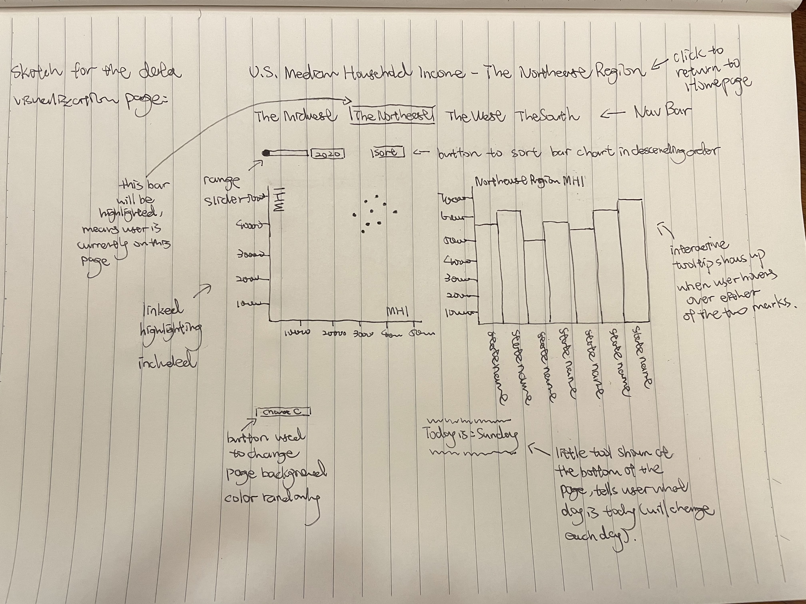

# PROPOSAL.md
A Markdown document exclusively dedicated to show the proposal of this project.

## Basic Information
* Project title: U.S. Median Household Income By Regions Visualization
* Team members:
    - Jason Lai
    - Di Wang

## Overview
When it comes to measuring the economic well-being of a country or some particular regions or states, median household income is one of those important factors that would not only tell us about the financial resources available to households, but also other closely related information such as employment levels, educational attainment, and health. For executives of companies who were wondering which state or region is an ideal place to promote their business, or for government officials who want to analyze some states’ current or past economic performances, or for the general public who simply want to have a sense of how they are doing financially in compared with others, the data behind median household income would sure answer their questions to some extent. Therefore, we are going to propose a visualization system to help address many of the economic concerns that people might face sometimes.

## Description of the Dataset and Processing
The data that we are going to use are the U.S. median household income data from 2016 to 2020. However, when searching for public datasets on official websites such as the American Community Survey or the U.S. Census Bureau, we see that we could not find a complete and cumulative dataset that fits our needs(some only have the data for a single year, while some others have taken the average of five years). Therefore, we have decided to self-collect the data, by manually gathering it from credible sources and putting it into separate csv files, categorized by four different regions in the States(northeast, midwest, south, west). In total, we will visualize 255 records, where each record has 4 attributes that describe the information about a particular state(state_name_full, median_income, year, population).

## Usage Scenarios & Tasks
William is the CEO of an automobile company that manufactures elegant and luxurious electric cars which are powered by an extremely sophisticated AI-driven system. Since the company has just been founded lately, William was wondering where exactly in the States should he deploy his first flagship store in order to gain the most sales out of it. While searching for economic statistics on the web, William has accidentally found our site and decides to give a try on our system. He wants to see which region in the States, particularly which specific state, that shows a high median household income for the past five years, since this data would somehow reflect the buying power of a particular state. By first getting on our site, William will see a navigation bar shown on top of the homepage, with each bar representing a particular region(midwest, northeast, west, south). The center of the page also shows four different pictures representing these four regions. Since William has no idea about the economic conditions of each state, he can either click through the link on the navigation bar or click on one of those pictures in order to get to the data visualization page. Say he first wants to explore the economic conditions of the northeast region, as he was too an NYU graduate who had spent his four years studying and living in New York. Once he gets onto this page, he will immediately see two charts lining horizontally and showing in the center. On the left is a scatterplot and on the right is a bar chart. Each point in the scatter plot represents a state and each bar in the bar chart also represents a state. On top of the charts there are two UI features provided by our system: first is a range slider that allows him to switch between different years to see how the MHI are changing among different states, and the second is a button that allows him to sort the bar chart in descending order, in order to quickly for him to discover which state in this selected region has the highest MHI and which state has the lowest, etc. In addition, when he hovers over either a point or a bar, the views are highlighted and linked bidirectionally. There will also be an interactive tooltip showing to the right of his cursor, which provides more detailed information on the state he is hovering over, such as year, name of the state, total population, and the exact MHI. If William obtains the information he needed for the northeast region, he can then click on another tab in the navigation bar to help him get to the visualization page of another region. Eventually, through exploring the MHI data visualized by our system, William should have a decent sense of where to deploy his first flagship store in the U.S.

## Description of Our Visualization & Initial Sketch
High-level description of the visualization interface(from top to bottom; homepage structure not discussed here, since it’s purely HTML, JavaScript, and CSS):  
&emsp;&emsp;1. H1 header at the top, showing the title of this page(link embedded; click will return to homepage) 
&emsp;&emsp;2. Navigation bar with current selected tab highlighted(tells users which region they are in)  
&emsp;&emsp;3. Range slider(able to switch between years) & sort button(used to sort bar chart in descending order)  
&emsp;&emsp;4. Scatter plot and Bar chart(linked highlighting & interactive tooltips)  
&emsp;&emsp;5. Button at the bottom left of the page(click to randomly change page’s background color in order to avoid the mundane white background when viewing data, which somehow makes the page looks aesthetically pleasing)  
&emsp;&emsp;6. P tag at the center bottom of the page, comes with a little decoratio (tells user what day is today; will change based on the Date() object)

 

Looking at the high-level description of our visualization interface, the charts are definitely our must-have features as without it we would consider our project a failure, since these two charts are the actual “data visualization” that we are building. The characteristics of our “innovative view components” are extensions of existing visualization types(scatter plot and bar chart). However, what makes them special is that we will add interactive features that allow users to interact with the data shown in front of them. For example, a range slider will be used to switch between different years. A sort button that allows users to sort the bar chart. Linked highlighting, as well as informative interactive tooltips, will both give users the ability to better explore our data and gain some insights into it.

Hand-drawn sketch of our visualization interface:  

## Work Breakdown and Schedule
1. Proposal: Jason and Di (est. hrs: 6~7; est. finish date: 4/21)
2. Data Collection & Processing: Di (est. hrs: 6~7; est. finish date: 4/24)
3. HTML Page Structures & Interactive Features: Jason (est. hrs: 6~8; est. finish date: 4 24)
4. Scatter Plot and Bar Chart: Jason (est. hrs: 8~12; est. finish date: 4/28)
5. Linked Highlighting: Jason (est. hrs: 2~3; est. finish date: 4/29)
6. 2 UI Widgets: Jason (est. hrs: 5~6; est. finish date: 05/03)
7. Interactive Tooltips: Jason (est. hrs: 2~3; est. finish date: 05/05)