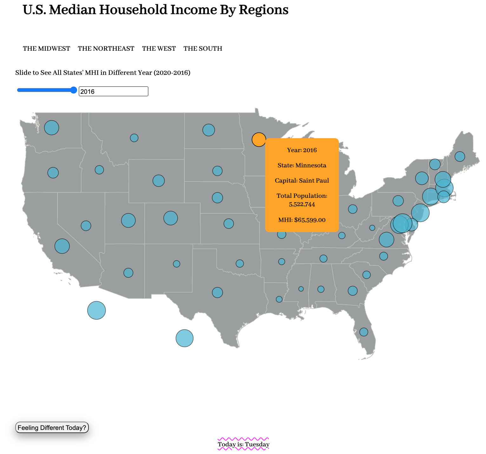

# Information Visualization Final Project Report

## Basic Information
* Project title: U.S. Median Household Income By Regions Visualization
* Team members:
    - Jason Lai
    - Di Wang

## Overview
* Screenshot of Our Visualization  
&emsp;1. Homepage

&emsp;2. One of the Regions' Visualization Interface

* Brief Summarization of Our Project
    - Original Intention Behind Our Design: when it comes to measuring the economic well-being of a country or some particular regions or states, median household income is one of those important factors that would not only tell us about the financial resources available to households, but also other closely related information such as employment levels, educational attainment, and health. For executives of companies who were wondering which state or region is an ideal place to promote their business, or for government officials who want to analyze some states’ current or past economic performances, or for the general public who simply want to have a sense of how they are doing financially in compared with others, the data behind median household income would sure answer their questions to some extent. Therefore, we intended to build a visualization system that may help address many of the economic concerns that people might face sometimes.

## Data
* Description of Our Data
    - The data that we used are the U.S. median household income data (2016 to 2020), U.S. states population data (2016 to 2020), U.S. state capitals data, and U.S. states coordinates data
* URL Links to the Source of Our Data
    - 2020 MHI: https://dqydj.com/average-income-by-state-median-top-percentiles/
    - 2019 MHI: https://dqydj.com/2019-average-income-by-state-median-top-percentiles/
    - 2018 MHI: https://www.census.gov/library/visualizations/interactive/2018-median-household-income.html
    - 2017 MHI: https://www.epi.org/blog/household-incomes-in-2017-stayed-on-existing-trends-in-most-states-incomes-in-21-states-are-still-below-their-pre-recession-levels/
    - 2016 MHI: https://www.census.gov/content/dam/Census/library/publications/2017/acs/acsbr16-02.pdf
    - 2020 Population: https://en.wikipedia.org/wiki/List_of_states_and_territories_of_the_United_States_by_population
    - 2019 Population: https://simple.wikipedia.org/wiki/List_of_U.S._states_by_population
    - 2018, 2017, and 2016 Population: https://www.census.gov/newsroom/press-kits/2018/pop-estimates-national-state.html
    - State Capitals: https://simple.wikipedia.org/wiki/List_of_U.S._state_capitals
    - States Coordinates: https://developers.google.com/public-data/docs/canonical/states_csv
* Brief Description of Our Data Processing Pipeline
    - When searching for public datasets on official websites such as the American Community Survey or the U.S. Census Bureau, we found that we could not find a complete and cumulative dataset that fits our needs (some only have the data for a single year, while others have taken the average of five years). Therefore, we decided to self-collect the data, by manually gathering it from credible sources and putting it into a composite csv file. In total, we visualized 255 records, where each record has 7 attributes that describe the information about a particular state (state_name_full, median_income, year, population, latitude, longitude, capital, region).

## Goals and Tasks
* Based on Usage Scenarios: as we have mentioned previously in our original intention behind design, users from all kinds of backgrounds and knowledge will be able to use our visualization system to seek for answers they intended to find. Companies’ CEOs can use our system to decide where to deploy and promote their businesses, government officials and economists can use our visualization interface to make economic analysis and prediction based on certain states or regions’ past or current performances, nearing graduated college students can use our system to somehow alleviate their pressures of looking for an ideal state to live and work, and even for ordinary families or individuals who have no profound understanding in economics to simply compare how they are doing financially with others within their residing states or regions.
* Based on Visualization Language: the symbol map of the U.S. shown in the center of the homepage plots all 50 states’ median household income data of a year, with each quantitative MHI value being encoded as a point mark and used position and size as its channels. The bigger the size of a circle, the greater the MHI value it represents. In addition, for each of the four regions’ visualization interface (midwest, northeast, west, south), there comes with a scatterplot and barchart lining horizontally and displaying in the center of the page. The former reveals the relationship between state population and state MHI, while the latter presents a region’s MHI, categorized by states belonging to that particular region.

## Visualization
* Description of Homepage Visualization Interface (from top to bottom)  
&emsp;1. H1 header at the top, showing the title of homepage (link embedded; click will refresh the homepage)  
&emsp;2. Navigation bar with each bar representing a particular region (midwest, northeast, west, south; click any of these tabs will head to the visualization interface of that region)  
&emsp;3. Range slider (UI widget; users are able to filter data by sliding to see all states’ MHI in different year)  
&emsp;4. Symbol map of the U.S., which displays all data items of a year. Point mark encodes quantitative MHI value, while using each state’s geographic coordinates as its position channel and the actual MHI value as determinant of its size channel (interactive tooltip shows up when user hovers on any of these circles, more detailed information about that state such as year, state name, state capital, total population, and the exact MHI value will appear)  
&emsp;5. Button placed at the bottom left of the page (click to randomly change page’s background color in order to avoid the mundane white background when viewing data, which somehow makes the page looks aesthetically pleasing)  
&emsp;6. P tag at the center bottom of the page, comes with a little decoration (tells user what day is today; will change based on the JavaScript Date() object)  

&emsp; - Feature 1: Tooltip Showing When Hovering Over Data Point, With State-Related Detailed Information Shown

&emsp; - Feature 2: Sliding to See All States' MHI in Different Year

&emsp; - Feature 3: Button Used to Randomly Change Page's Background Color, in Order to Avoid the White Mundane Background When Viewing Data & Date Reminder

* Description of Visualization Interface Based on Region (from top to bottom)  
&emsp;1. H1 header at the top, showing the title of this page (link embedded; click will return to homepage)  
&emsp;2. Navigation bar with current selected tab highlighted (tells users which region they are in)  
&emsp;3. Range slider (slide to filter data based on different year) & sort buttons (click to sort bar chart in either descending or ascending order; allow users to change the attribute that is used to order the data)  
&emsp;4. Scatter plot:  
&emsp;&emsp;&emsp;a. Data: 2 quantitative attributes (state population and state MHI)  
&emsp;&emsp;&emsp;b. Mark: points  
&emsp;&emsp;&emsp;c. Channels: horizontal + vertical position  
&emsp;&emsp;&emsp;d. Tasks: find trends, outliers, distribution, correlation, and clusters  
&emsp;5. Bar chart  
&emsp;&emsp;&emsp;a. Data: 1 categorical attribute and 1 quantitative attribute (state name and state MHI)  
&emsp;&emsp;&emsp;b. Mark: lines  
&emsp;&emsp;&emsp;c. Channels:  
&emsp;&emsp;&emsp;&emsp;&emsp;- Vertical position: quantitative value  
&emsp;&emsp;&emsp;&emsp;&emsp;- Spatial regions: one per mark; separated horizontally, aligned vertically  
&emsp;&emsp;&emsp;d. Tasks: compare different state’s MHI value, or look up for certain values  
&emsp;6. Button placed at the bottom left of the page (click to randomly change page’s background color in order to avoid the mundane white background when viewing data, which somehow makes the page looks aesthetically pleasing)  
&emsp;7. P tag at the center bottom of the page, comes with a little decoration (tells user what day is today; will change based on the JavaScript Date() object)

&emsp; - Feature 1: Tooltip Showing When Hovering Over either Circle or Bar, With Bidirectionally Linked Highlighting  
&emsp;&emsp;&emsp;a. Shared data: subset  
&emsp;&emsp;&emsp;b. Encoding: multiform  
&emsp;&emsp;&emsp;c. Shared encoding: highlighting color  

&emsp; - Feature 2: Sliding to See Different Year's MHI and Population Data for States in the Selected Region  

&emsp; - Feature 3: Click to Dynamically Sort Bar Chart in Descending or Ascending Order  
&emsp;&emsp;&emsp;a. In Descending Order

&emsp;&emsp;&emsp;b. In Ascending Order

&emsp; - Feature 4: Button Used to Randomly Change Page's Background Color, in Order to Avoid the White Mundane Background When Viewing Data & Date Reminder  

## Reflection
* How Our Project Has Developed From Our Initial Proposal to the Final Product:
    - Initially, before writing the proposal, Di and I had chatted about the potential topic that we could use for our project. By pondering around while checking for trending topics, we eventually decided to design a visualization system that would help the general public to somehow tackle down issues regarding their economic concerns, as it is too an important topic that people often chat about from day to day. After finishing with our initial proposal, Di’s job was to primarily collect the data and validate them, whereas my part was to code up our entire front-end visualization system using HTML, CSS, JavaScript, D3, and React. However, after receiving evaluation from Professor Gu, we acknowledged several problems indeed existed in our project that needed to be fixed. First of all, the scatter plot in our initial proposal was problematic as its design and use was unclear. What we originally sketched is a scatter plot with data encoding the same quantitative attribute, which did not make sense since the points in scatter plot would all show up on the diagonal. In addition, even though state population data was included in our dataset, we had yet to find a method to visualize it. Moreover, since our initial encoding strategy had splitted the entire U.S. median household income data into four different regions, there seemed to be a lack of an overview of data, where all data items of a year should display somewhere in a main view. Therefore, after reconsidering design and re-evaluating potential technical difficulties, we decided to use state median household income and state population as our two quantitative attributes to be encoded by the scatter plot, and by adding a symbol map of the U.S. that shows all 50 states’ median household income of a year in the center of our homepage. Luckily, the whole development process went smooth, and we finally had come up with our final product that is being demonstrated in the report above.
* How Have Our Visualization Goals Changed:
    - In terms of visualization goals, our goals did not change throughout the whole process, as our primary focus was to help the general public to address many of the economic concerns that they might face sometimes.
* How Have Our Technical Goals Changed:
    - Initially, what we’ve proposed for our visualization system was to use a scatter plot and a bar chart, while combining UI widgets such as range slider and sort buttons, and with interactive tooltips that will appear when users hover over data items. However, as we have mentioned previously, comments received from Professor Gu made us rethink our design, and we eventually came up with the idea to develop a symbol map that would show all data items of a year in our main homepage view, with range slider and interactive tooltips equipped.